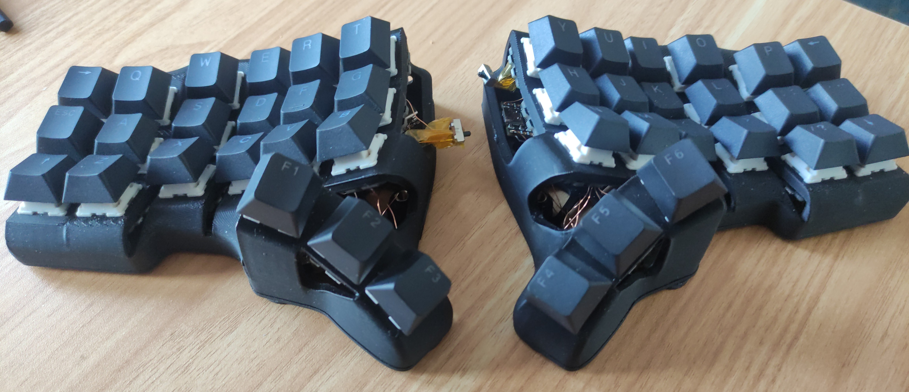
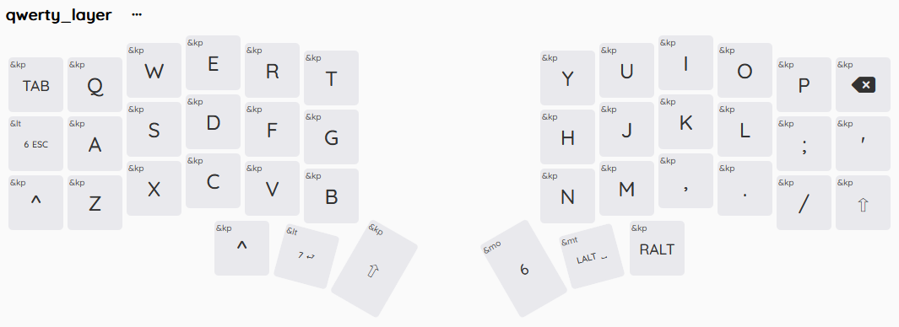
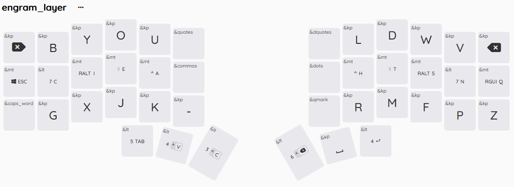
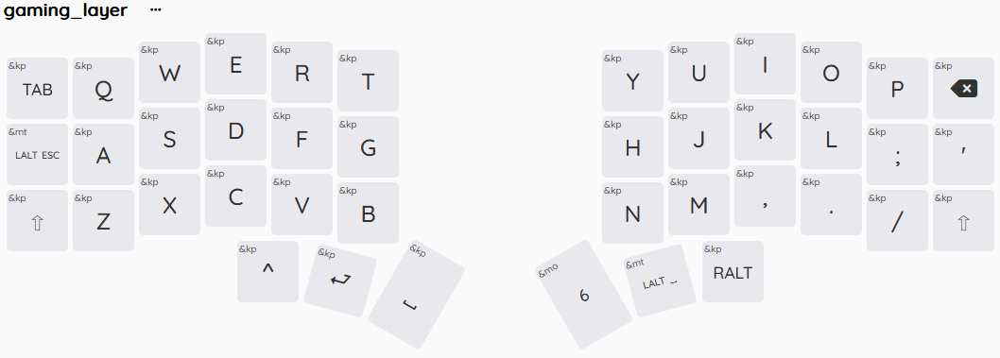
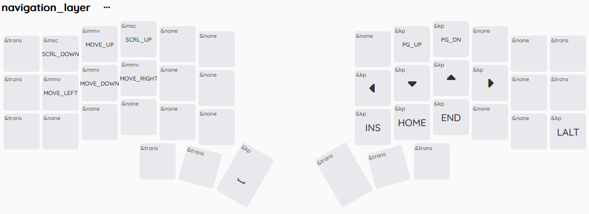
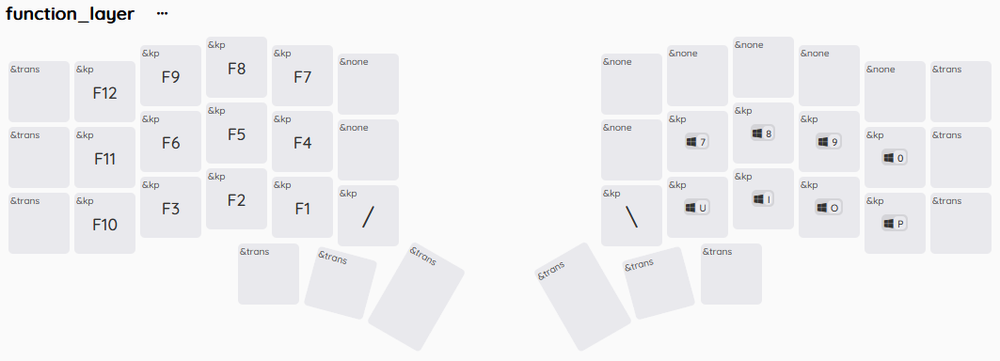
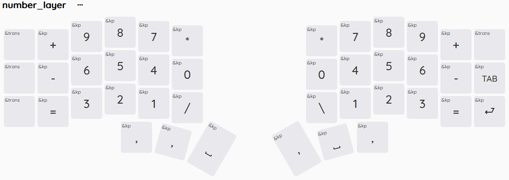
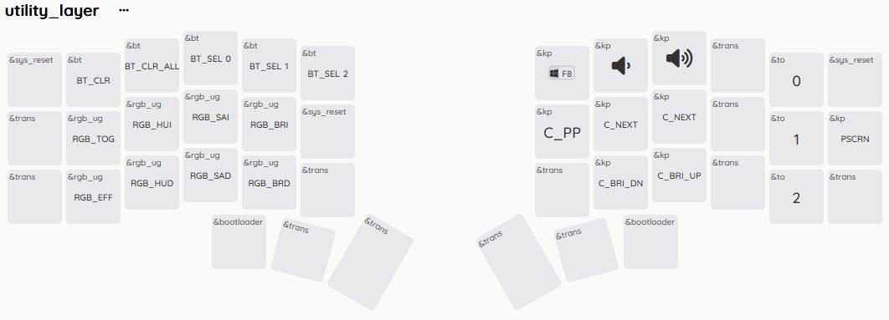
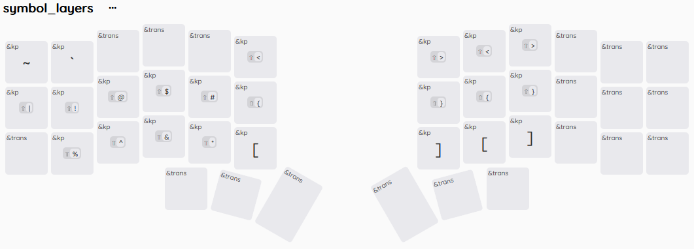

# ErgoKeeb

*[ErgoKeeb](https://github.com/ErgoAsh/zmk-ergokeeb)* is a custom, hand-wired Skeletyl keyboard. It's fully wireless, using ZMK and an nrf52840 chip. Every key has an Amoeba King PCB with hot-swap, LED, and diode.

Main keymap is based on [engram](https://engram.dev/) (with changed `z` key position) and uses Miryoku-like [modifiers](https://github.com/manna-harbour/miryoku/) (swapped `ctrl` and `shift` positions, different symbols layer).

## Layers

